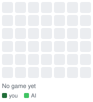

# Commit Four board

This repository is a **game board**, not a project. the owner plays Connect 4 against an AI on their
GitHub contribution graph, and every piece on the graph is a handful of backdated, empty commits here.

| Square | Meaning |
|---|---|
| darkest green (4 commits) | the owner's piece |
| mid green (2 commits) | the AI's piece |
| one dark square on Jan 1 | the season's scale anchor |

Games are drawn in past "season" years (2016, then 2015, ...), six boards per year. Open the season
year on the profile to see them. The full move history lives in [`state/game.json`](state/game.json).

Made with [Commit Four](https://github.com/NickHarder/commit-four-engine). Unofficial; not affiliated with GitHub.

> Deleting this repo removes the pieces from the graph eventually, but GitHub can keep the year tabs around.
